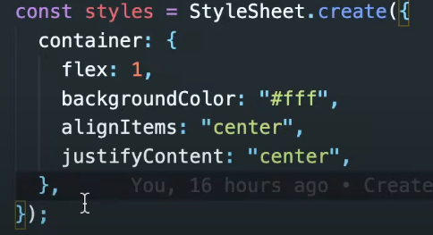
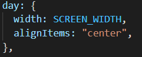

expo init 앱 이름

expo login

## react-native 규칙

#### 1. react native는 웹사이트가 아니다

- div 쓸 수 없다
- View를 쓴다.
- div 대신 View를 쓴다. 항상 View 임포트 시켜야함

#### 2. 모든 text는 text component에 들어가야한다.

- span, p가 없다.

#### 3. View에 style이 있다.

- 일부 style은 사용할 수 없다.
- ex) border : "1px green dashed"   -> 오류
- border는 올바른 프로퍼티가 아님.
- 거의 모든것을 가져오려고 함.
- 98%는 쓸 수 있다.

#### 4. StyleSheet.create란 ?

- object를 생성하는데 사용한다
- 그냥 object를 만드는건데, 좋은 자동 완성 기능을 제공
- 그냥 style={{fontSize: 48}} 같이 써도 됨!

#### React native packages

- status-bar component : 시계, 배터리, wifi

- react native는 네비게이션바를 제공하지 않는다.
- AsyncStorage라는 모바일 환경의 localstorage가 있는데, 사용하기 위해선 다운로드 받아서 import 해야함.

#### third party packages

- component : 화면에 렌더링할 화면
  - View
- API : 자바스크립트 코드
  - Vibration : 디바이스 진동.

- reactnative.directory(웹사이트)에는 third-party package와 api가 있다.

## layout system

- flexbox
  - 웹과 다르다. block, inline block 같은게 없다.
  - 오로지 
- View : 기본적으로 flex container임. direction은 기본적으로 column임. 즉, display:flex와 같은것은 설정할 필요 없음.
  - row로 하고 싶으면 flexDirection:"row"로 설정해주면 됨.
  - 웹에서는 row였음
- overflow가 있어도 스크롤이 자동으로 되지 않는다. 웹과 다르기 때문.
- 반응형을 위해 구많은 스크린에서 동일한 그림이 그려지도록 해야함.
- width와 height를 사용하지 않을것임.
- 숫자만 생각해라!
  - View가 모두 Flex contatiner이기 때문에 flex size만 설정해준다.

	- 부모 flex 크기의 1배,2배,1배
	- Flex 부모를 만들고 자식의 크기를 숫자로 설정할 수 있다.
	- 비율로 계산한다고 생각하면됨.

## Styles

- location을 통해 현재 위치를 받아올 수있다.

- expo 쓸때 팁
  - 배쉬 창에서 r 누르면 새로고침
  - d 누르면 개발자도구(콘솔창) 열림
  - m 누르면 토글 창. 혹은 휴대폰 흔들면
- 아무리 내용이 많아도 그냥 스크롤은 발생하지 않는다.

- View 컴포넌트를 쓰기 때문!

- 모든게 다 컴포넌트이기 때문에 스크롤을 넣기 위해선 ScrollView를 사용해야한다.

  - ScrollView에서 horizontal props를 사용하면 가로 스크롤로 변경 가능하다.
  - 단 이럴때 사이즈가 달라짐.
  - 따라서 props를 쓰면 안됨.

- 휴대폰 사이즈를 알려주는 API가 있다.

  - Dimensions를 통해 화면 크기를 얻을 수 있다.

  - 

  - 

  - 어떤 props는 안드로이드에서만, 어떤 props는 IOS에서만 동작한다.

## Location

- 컴포넌트가 마운트 될 때 -> useEffect